# R1 — Orchestration State Machine
States and transitions for a single generation run.

```mermaid
stateDiagram-v2
  [*] --> CollectInputs
  CollectInputs --> ValidateSpec : Source Spec or Idea+Decisions
  ValidateSpec --> FillGaps : Problem Framer (if needed)
  FillGaps --> Research : Librarian (optional/flagged)
  Research --> SliceMVP
  SliceMVP --> WritePRD
  WritePRD --> GenDiagrams
  GenDiagrams --> TestPlan
  TestPlan --> Roadmap
  Roadmap --> RedTeam
  RedTeam --> RenderPacks
  RenderPacks --> Package
  Package --> Audit
  Audit --> [*]

  state FillGaps { [*] --> Framer; Framer --> [*] }
  state Research { [*] --> Search; Search --> Extract; Extract --> [*] }
```

**Guards**: `offline==true` skips Research.  
**Retries**: Research and RenderPacks have limited retries with backoff.  
**Budgets**: max 12 agent steps; per-step timeout 20s.
